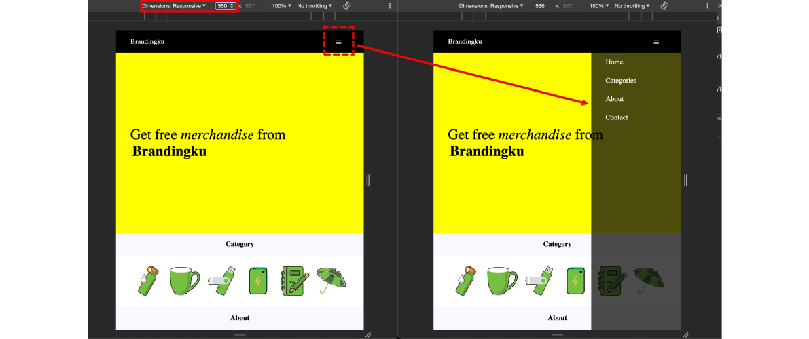
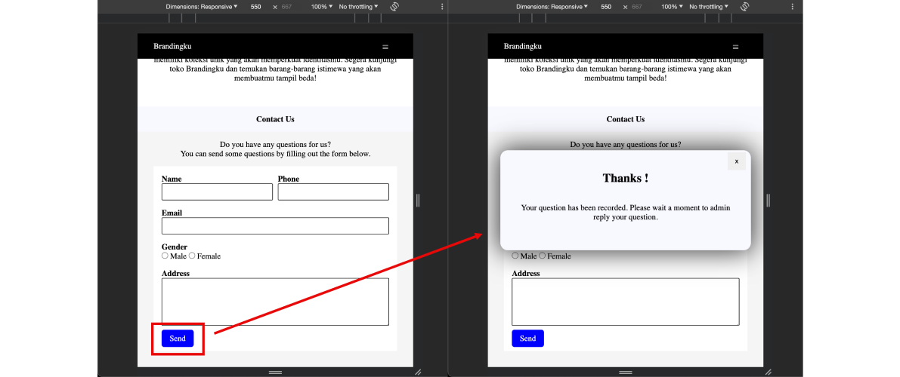

# Assignment 
## Module 1 - Checkpoint #1

This is for assignment module 1 FSSE Class of Jan 2024, Web Development Essentials.

The deadline for this task at Friday, Feb 9th 2024

my live link has going on : [HERE !](https://revou-week0.netlify.app/)

---

## Features in this page

#### 1. Responsive Navbar

_You will see complete menu in above 550px width resolution_

_- You will see hamburger icon at the top-right in below 550px width resolution_

_- If you click the hamburger icon, you will see sidebar with all menu_

#### 2. Animate transition popup

_- If you click the submit button, you will see alert notification_

_- You also can click the close button at the popup and alert notification can be hiding_

---

Let's learn more about software engineers

